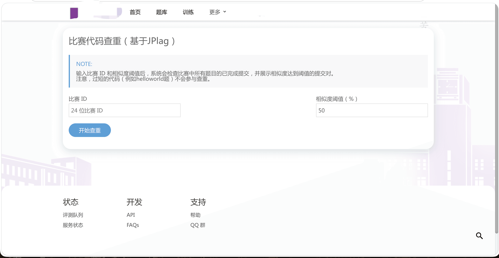
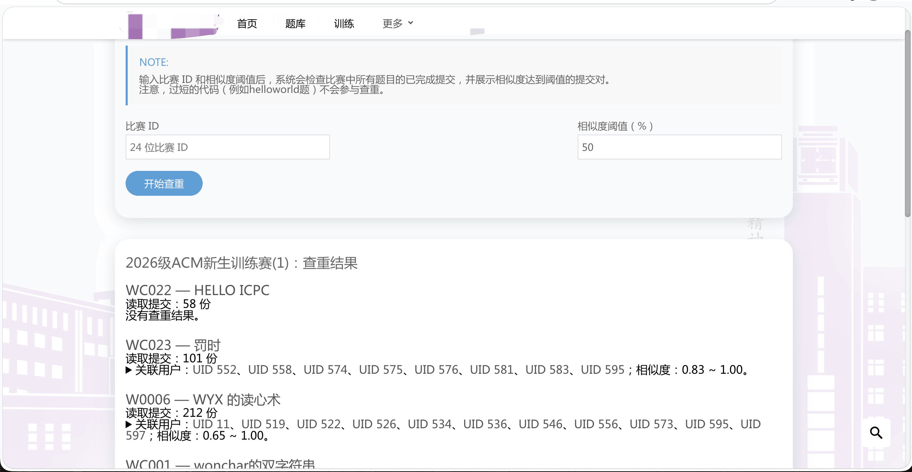
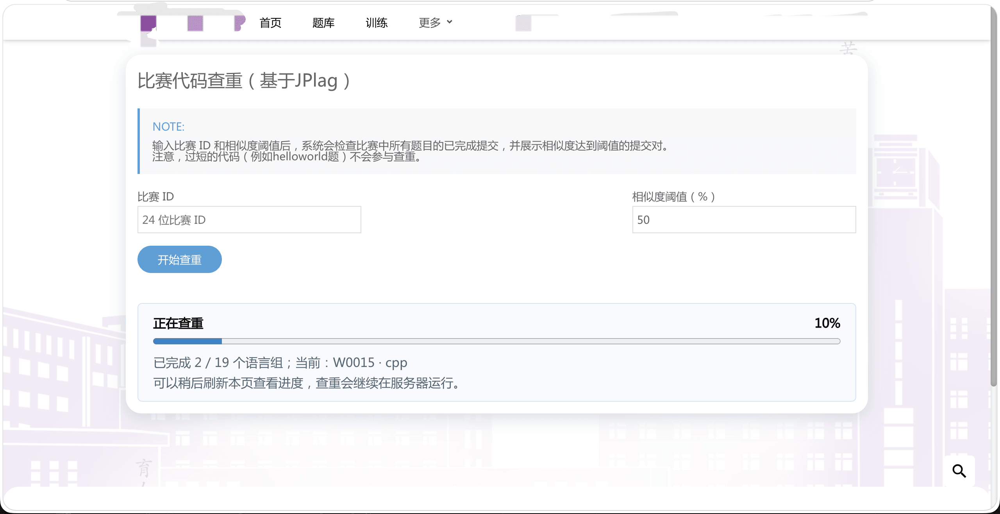

# hydrooj-sim

基于JPlag实现的 Hydro 比赛代码查重插件。管理员在输入比赛 ID 和相似度阈值后，插件按题目和语言分别调用 [JPlag](https://github.com/jplag/JPlag)，并在页面展示相似的提交对和并排代码 Diff。

插件自带 [JPlag 6.2.0 JAR](https://github.com/jplag/JPlag/releases/download/v6.2.0/jplag-6.2.0-jar-with-dependencies.jar) 和 Linux x64（x86_64）Java 21 运行时。在 Linux x64 系统上，插件自动使用内置 Java，服务器无需另行安装 Java 或 JPlag。

其他操作系统或 CPU 架构则使用服务器 PATH 中的 `java`。请安装 Java 21 或更高版本，并确保 Hydro 服务进程能够执行 `java`。

由于内置 Java 和 JPlag，当前插件大小已超过 100 MB。

## 安装

1、安装命令：

**方式A：GitHub Release 压缩包安装 (推荐)**

在 [Releases](https://github.com/HuParry/hydrooj-sim/releases) 页面找到所需版本，在 Assets 中复制 `hydrooj-sim-版本号.tgz` 的下载链接，然后执行：

```sh
hydrooj install https://github.com/HuParry/hydrooj-sim/releases/download/v0.2.12/hydrooj-sim-0.2.12.tgz
pm2 restart hydrooj
```

请将示例版本号替换为实际发布版本。使用 Release 附件中的 `.tgz` 安装包；安装命令需要下载链接。

**方式B：git clone + 一键脚本**
```sh
git clone https://github.com/HuParry/hydrooj-sim.git ~/.hydro/addons/hydrooj-sim
cd ~/.hydro/addons/hydrooj-sim
./deploy.sh           # 自动 hydrooj addon add + pm2 restart hydrooj
```

2、重启 HydroOJ

3、在首页菜单加入超链接至 `/sim`，访问 `<OJ地址>/sim`。注意只有比赛拥有者、具有编辑比赛权限的管理员和系统管理员可以使用查重功能。

## 使用

1. 从比赛链接中复制 24 位比赛 ID，填入页面。
2. 输入相似度阈值（0–100，默认 50）。
3. 点击“开始查重”，页面会显示按题目和语言分组的查重进度。查重在服务器继续运行，可以稍后刷新任务页面查看结果。
4. 展开有结果的题目查看提交对；点击 Diff 可在弹窗中查看两份代码。UID 和提交 ID 均可点击进入相应页面。

插件读取该比赛各题所有已完成且含代码的提交，按题目和语言分组；不同语言不会互相比较，同一用户的提交对不会出现在结果中。JPlag 支持的语言使用对应解析器，其他语言使用 `text` 解析器，但仍按 Hydro 语言 ID 分组。

当前 JPlag JAR 支持 C、C++、C#、EMF、EMF Model、Go、Java、JavaScript、Kotlin、LLVM IR、Multi-language、Python 3、R、Rust、Scala、Scheme、SCXML、Swift、Text 和 TypeScript。Hydro 的常见语言变体（如 `cc.*`、`py.py3`、`py.pypy3`、`kt.jvm`）会映射到相应解析器。

页面展示 JPlag 的 `AVG` 相似度，百分比最多保留两位小数。插件使用原始精度筛选阈值，再格式化展示。JPlag 对最短匹配长度采用各语言默认值，因此过短或无法解析的代码可能不参与比较；页面不会显示跳过原因或数量。没有可展示的提交对时，页面显示“没有查重结果”。

每个语言组的运行超时默认为 300 秒，可通过 Hydro 系统设置 `jplag.timeoutSeconds` 调整，允许范围为 10–1800 秒。代码和 JPlag 报告只写入查重任务的临时目录，任务结束后会删除。任务进度和结果在数据库中保留约 24 小时。

## 效果图







## 许可

本插件以 [AGPL-3.0-or-later](LICENSE) 发布。

随包的 JPlag JAR 使用 GPL-3.0，许可文本见 [`lib/JPLAG-LICENSE.txt`](lib/JPLAG-LICENSE.txt)。

Java 运行时的许可及第三方声明位于 `runtime/linux-x64/legal/`；jsdiff 和 adm-zip 的许可分别位于 `lib/vendor/JSDIFF-LICENSE.txt` 与 `lib/vendor/adm-zip/LICENSE`。
